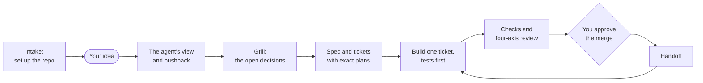
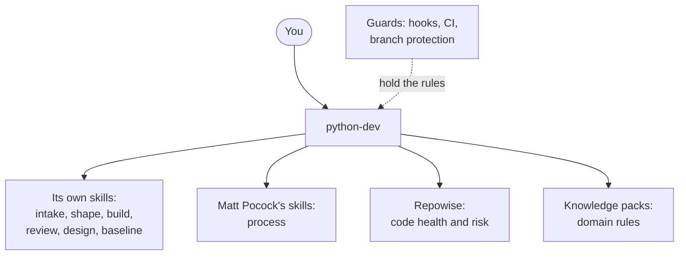
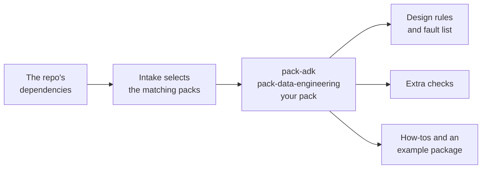

# python-dev

An agent that runs uses development processes on every change to a Python repo.

Coding agents are fast, and they work differently every time: one day a plan and tests, the next day code straight from a chat message. python-dev is a senior engineer harness selectable as your agent in Claude Code or GitHub Copilot: it takes users through a lifecycle, and calling well known tools like Grill-me and Repowise to audit the code. You talk, decide, and approve each merge.

## How a change flows



| Stage | What happens |
|---|---|
| Intake | Once per repo: the checks, the docs and a tracker for tickets are set up. |
| View | The agent reads the code, then says what it would build, what it would leave out, and why. |
| Grill | It asks you the open decisions in short rounds, each with its recommended answer. |
| Spec and tickets | The design is written down and cut into tickets (units of work). Each names its files, functions and tests. |
| Build | One ticket per session, on its own branch. Each test is written before the code it tests. |
| Review | Linting, type checks, tests and a review of the change. |
| Merge | Nothing reaches `main` until you say yes. |
| Handoff | A note for the next session, so it starts where this one stopped. |

The rule underneath: **no ticket, no code.** A one-line fix gets a one-line ticket.

## A first session

An illustration of the first exchange:

```text
python-dev <version> · branch main · guards on · tracker GitHub Issues · next: your request

You:    Add a CSV export to the orders report.

Agent:  A new idea, so I shape it before any code.
        My view: build it as one more writer beside the PDF writer. Leave out
        scheduling; nothing asks for it yet. One ticket. No choice here is hard to undo.

        1. Which columns? I recommend the same ones the PDF shows.
           Reason: one definition of the report. Cost of others: two to maintain.
```

No status line means you are talking to the default agent, not python-dev.

## Install

You need [uv](https://docs.astral.sh/uv/) and Python 3.11 or newer. Two plugins are installed: Matt Pocock's process skills, and this one.

**Claude Code**

```text
/plugin marketplace add mattpocock/skills
/plugin install mattpocock-skills@mattpocock
/plugin marketplace add fbhadha/py-dev
/plugin install python-dev@py-dev
```

Start it in your repo with `claude --agent python-dev`.

**GitHub Copilot CLI**

```text
copilot plugin marketplace add mattpocock/skills
copilot plugin install mattpocock-skills@mattpocock
copilot plugin marketplace add fbhadha/py-dev
copilot plugin install python-dev@py-dev
```

Start it in your repo with `copilot --agent python-dev:python-dev -i "start"`.

<details>
<summary>VS Code (Copilot Chat)</summary>

In your user settings, set `"chat.plugins.enabled": true` and `"chat.plugins.marketplaces": ["fbhadha/py-dev", "mattpocock/skills"]`. Set the session target to Copilot and pick python-dev in the Agent dropdown.

The plugin's hooks do not run in VS Code. The guards there are your repo's CI and branch protection.

</details>

<details>
<summary>From a clone, without installing</summary>

```text
claude --agent python-dev --plugin-dir /path/to/py-dev
```

</details>

The first session in a repo runs intake. Every session after that starts with the agent reading the repo's state and saying what comes next.

## What it orchestrates



A skill is a set of instructions an agent loads when a task needs it. python-dev decides which one runs when. The ones it did not write are installed from their maintainers and called by name, never copied.

| Source | What it gives |
|---|---|
| [Matt Pocock's skills](https://github.com/mattpocock/skills) | Process: test-first building, code review, bug diagnosis, research. |
| [Repowise](https://github.com/repowise-dev/repowise) | A command-line tool that measures the code: health, risk, unused code, which decision governs which file. |
| [Google's ADK skills](https://github.com/google/adk-python) | Knowledge of Google's agent framework. Installed only in repos that use it. |
| [AI Coding Dictionary](https://github.com/mattpocock/dictionary-of-ai-coding) | Plain definitions of the words of AI coding. |

## Knowledge packs

A knowledge pack teaches the agent one Python ecosystem. It is how you extend python-dev without changing how it works.



| Pack | Selected when the repo depends on | What it adds |
|---|---|---|
| [pack-adk](skills/pack-adk/SKILL.md) | `google-adk` 2.x | Six rules for agents, and testing by a simulated user. |
| [pack-data-engineering](skills/pack-data-engineering/SKILL.md) | dlt, pandas, polars, SQLAlchemy, DuckDB and others | Four pipeline shapes, a tested example package, sixteen faults to look for. |

Every pack has the same sections: what selects it, the shapes it knows, a well-known repo to cite, extra checks, faults, tests. To write one, follow [CONTRIBUTING.md](CONTRIBUTING.md) and start from [packs/TEMPLATE.md](packs/TEMPLATE.md).

## Guards

`main` changes only by a merge you said yes to, and hooks hold that rule even when the model forgets it.

| Guard | What it stops |
|---|---|
| The hook asks before anything lands on `main` | A commit or merge to `main` without you. |
| No ticket, no code | Code written straight from a chat message. |
| The never list | Force-push, hard reset, rebase, `--amend`, `--no-verify`. Denied on every branch. |
| Tests stay real | A change that deletes a test, skips one, or loses assertions fails CI. |

The full list is in [docs/how-python-dev-works.md](docs/how-python-dev-works.md).

## Help

Open a [GitHub issue](https://github.com/fbhadha/py-dev/issues).

## Contributing

Pull requests for knowledge packs are welcome. [CONTRIBUTING.md](CONTRIBUTING.md) has the steps, what a pack must meet, and the commands that check this repo.

## Licence

Apache-2.0. `NOTICE` lists what is called from elsewhere.
